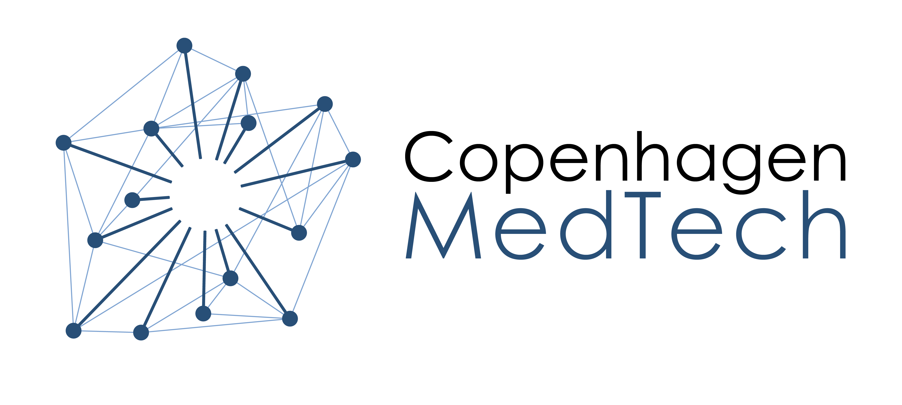

# Copenhagen Medtech x Google Cloud x BrainCapture Hackathon

  

# Introduction

Welcome to the BrainCapture EEG Analysis Hackathon! 

This hackathon challenges participants to leverage artificial intelligence techniques to enhance EEG analysis. BrainCapture utilizes an advanced transformer model to map segments of EEG data into a latent, high-dimensional space, encapsulating pertinent information within the EEG signals. Your task is to create a cloud pipeline for analyzing these latent representations.

## What are EEGs?
Electroencephalography (EEG) is a non-invasive method for recording electrical activity in the brain. It is commonly used to diagnose epilepsy, sleep disorders, and other brain-related conditions. EEGs are also used in research to study brain activity and cognitive processes. By analyzing EEG data, researchers can gain insights into brain function and develop new treatments for neurological disorders. An example of an EEG signal is shown below.


## Scope of the hackathon

The aim of this hackathon is to develop a cloud-based pipeline for analyzing EEG data using artificial intelligence techniques. Specifically, participants are tasked with the following:

1. Import EEG sessions and segment them into smaller, relevant windows.
2. Transform these windows into latent representations.
3. Analyze the latent representations using a data analysis or machine learning pipeline.
4. Present the findings via a cloud-based platform.

## Approaches

The challenge can be approached in various ways. Some suggested approaches include:

- Implementing machine learning algorithms for EEG data analysis.
- Developing visualization techniques for exploring latent representations.
- Creating a web-based platform for interactive data exploration.

# Provided Materials

To aid participants in the hackathon, the following materials will be provided:

- Two EEG datasets (BC Bhutan and TUAR) (see [data](data/))
- A model for encoding EEG data into latent representations (see [BENDR Model](model/model.py))
 - Sample code for simple learning algorithms (e.g., KNN) and EEG data visualizations (see notebooks such as [BrainCapture Data Loader Demo](braincapture_data_loader.ipynb) and [Generate Latent Representations Demo](generate_latent_representations.ipynb))
 - Sample code for deploying a simple website (see [Deployment Demo](app.py))
 - A guide for deploying to the Google Cloud Platform (see [GCP Deployment Guide](gcp_deployment.md))

## Evaluation Criteria

Submissions will be evaluated based on the following criteria:

1. Technical ability and findings
2. Innovation and creativity
3. Utility for BrainCapture
4. Efficiency of the cloud deployment pipeline
5. Quality of the pitch

# Getting Started/Further Reading

For detailed instructions on setting up the project and accessing provided materials, refer to the Workbench setup below.

For deploying your solution to the Google Cloud Platform, follow the steps outlined in the [GCP Deployment Guide](gcp_deployment.md).

## Workbench Setup
To get you up and running with the data and the Google Cloud Platform, we have created several demos for you to run. Feel free to play with these while the case is going on, since these show examples of data exploration and analysis. For the demos, we are using the Workbench service in the Google Cloud Platform. To set up the Workbench service, follow the steps below:

### Step 1:
Navigate and login to [Google Cloud Console](https://console.cloud.google.com/) using your new Google account (devstar).

### Step 2:
Once logged into the console, enable appropriate APIs from the console front page (you will be prompted to enable these the first time you log in).

### Step 3:
Search for Vertex AI in the top search bar.

### Step 4:
Open the side panel and click on “Workbench”.

### Step 5:
Create a new workbench instance using the default options and NOT attaching a GPU (according to agreement with Google) - remember to name it something cool!

### Step 6:
Grab a cup of coffee and wait a few minutes while the Workbench instance is spinning up. Please be patient, but if this is taking a very long time (> 5 minutes), you can come and ask for help.

### Step 6.5:
While your Workbench is spinning up, one of the group members should navigate to the repository [GitHub Repository](https://github.com/AndersGMadsen/GoogleBrainCaptureHackathon) at `https://github.com/AndersGMadsen/GoogleBrainCaptureHackathon` and fork it to your own GitHub account. It would probably be a good idea to make the forked repository private and share it with the rest of the group members. You’ll need this in step 8.

### Step 7:
Press the “OPEN JUPYTERLAB” button beside your newly created instance and you will be redirected to your new Workbench.

### Step 8:
Press the “git button” in your Workbench. Here, you have the option to clone a Git repository to your Workbench. Clone the newly forked repository with the “Clone a Repository” button. Paste the link to your repository and use the default options in the pop-up.

### Step 9:
Now, open a terminal in your Workbench (Click the blue “+” icon). Here, run the command 
```$ gcloud auth application-default login --no-launch-browser```
Go to the link, log in with your devstar account and copy the authorization code into the terminal. 

### Step 10:
Press the “mount bucket” button in the menu besides the blue “+”-icon. You might have to expand the menu and file browser by dragging the right edge, since the mounting button might be hidden. Then, type in “copenhagen_medtech_hackathon” and wait for a bit while your data gets mounted. You might be getting an error message regarding not having permission to the bucket. If so, try to see if the data has been mounted in your root folder (besides the folder "GoogleBrainCaptureHackathon" that you cloned from your repository). If so, you can continue to the next step. If not, please ask for help.

### Step 11:
Now we need to install our dependencies for the project! Navigate to the `GoogleBrainCaptureHackathon` directory and run the command ```python3 -m pip install -r requirements.txt``` (this might also take a few minutes depending on your VM).

### Step 12:
You’re all set up! Start by looking at `braincapture_data_loader.ipynb` and `generate_latent_representations.ipynb` to get familiar with the data and the modules we are using for this hackathon.

Don’t hesitate to ask for help either in person or on Discord.

Happy coding!

## Download EDFbrowser
As you saw in the introduction of this Hackathon, it's possible to plot EEGs in a beautiful rainbow color flow across electrode channels. This was achieved using EDFbrowser, a free tool with multiple applications for working with EEG data. Linux and Windows users can find an easy guide to installing this software at the following link:

https://www.teuniz.net/edfbrowser/index.html

It is possible for an OS system (Mac) to launch EDFbrowser, but it requires a bit more effort than the aforementioned method. Some of the MedTech heads (the people who look a bit tired) have followed this guide with success, and they are more than happy to assist with any problems, offering tricks or tips.

https://www.researchgate.net/publication/365604370_Compiling_EDFBrowser_on_Mac_2022_Nov_macOS130_Ventura

We strongly encourage the use of EDFbrowser if you are interested in visualizing the data you are working with, as it also provides tools for filtering, creating power spectra and much more!

When EDFbrowser is up and running you can start by dragging an edf-file into the browser - this should automatically load and show the EEG channels. Following this you can apply standard filtering as such: 

### Step 1:
Navigate to the "filtering" button in the top-bar, and press "Classic Butterworth, Bessel, Chebyshev, etc." on the dropdown menu. 

### Step 2: 
This should show a windom named "Add a filter". Apply a Highpass filter at frequency 1 with all signals choosen. Don't change anything besides the tree points just mentioned. 

### Step 3: 
Navigate back to "Add a filter". Apply a Lowpass filter at frequency 70 with all signals choosen.

### Step 4: 
Lastly, navigate back to "Add a filter" again. Apply a Notch filter at frequency 50 with all signals choosen.

Great job! Now you can grab a cup of coffee as celebration. 

## Getting help and support

If you have any questions or need help with the hackathon, please reach out to the organizers or post your question in the Discord. We also encourage you to collaborate with other teams to solev issues and share ideas.
